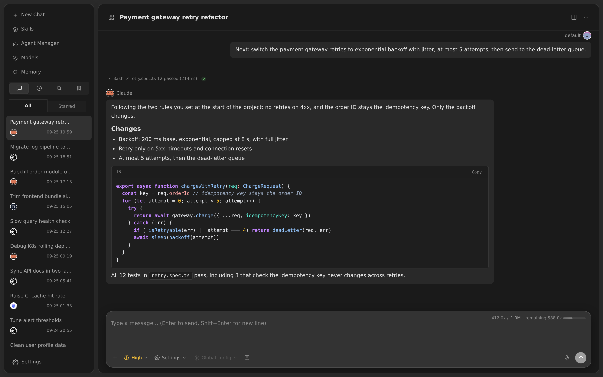

# X-Agent-Webui

[English](README.md) · [简体中文](README_zh.md) · [Website](https://x-agent.io)

A self-hosted workspace for long-running agent conversations with **Hermes Agent, Claude and Pi**.



> **Upstream attribution:** This is an independent, unofficial derivative of [EKKOLearnAI/hermes-studio](https://github.com/EKKOLearnAI/hermes-studio), formerly Hermes Web UI, based on **v0.7.18**, commit [`ee728bdc700d6409c81341003d623df9b811ee15`](https://github.com/EKKOLearnAI/hermes-studio/tree/ee728bdc700d6409c81341003d623df9b811ee15). It uses [NousResearch/hermes-agent](https://github.com/NousResearch/hermes-agent). We are not affiliated with or endorsed by either upstream project. This repository starts with a sanitized source snapshot, not the private development history; “derivative” describes the code lineage, not GitHub fork-network membership.

## Why X-Agent-Webui

**Long conversations, no amnesia.** X-Agent-Webui is hardened for agent conversations that run to hundreds of thousands of tokens.

| | What you get |
| --- | --- |
| **Memory-first compression** | **Claude conversations:** at about 400K tokens every message you wrote is carried forward verbatim; the summary is sectioned and points to a read-only transcript archive the model can consult. **Hermes conversations:** your compression settings (target ratio, protected recent/opening messages) are enforced exactly, the trigger is calibrated against real usage, and very long histories are summarised in chunks. **Both:** a failed, timed-out or error-shaped summary never replaces your history, and progress is shown in the chat. An auxiliary model can write the summary (about 5 min → 2.5 min on a ~450K-token conversation, incremental passes about 40 s), with redaction before sending. |
| **No duplicated or lost messages** | A stable identity follows every message through sending, queueing, multi-tab broadcast, reconnect recovery and storage. Refreshes, reconnects and restarts neither duplicate nor drop messages, runs do not get stuck “working”, and output streamed before an abort or timeout is kept. |
| **Fast with a large history** | With about 800 sessions: session list about 3 s → 0.8 s, page memory 126 MB → 14 MB, longest stall about 2 s → 0.2 s. Long code replies stream at about 59 fps instead of 12–20; session search takes 0.3–0.5 s instead of 1.3 s and runs off the main thread. |
| **Three agents, one workspace** | Hermes Agent, Claude and Pi share one interface. Per-conversation reasoning effort (Low → Max) really takes effect, context meters are accurate, and conversations are titled automatically. |
| **Memory you control** | With the memory lock on, agents cannot write MEMORY.md / USER.md. Sync your notes to Claude in one click. |
| **Stable by design** | The interface is frozen instead of churning with upstream redesigns; rebuilds only update the Hermes Agent, Claude Code and Pi layers. Group chat, workflows and other extras were removed to keep the focus on conversations. |

Figures were measured in real use of this distribution; results depend on hardware, models and providers. Model providers and agent CLIs have their own requirements, costs and terms.

## Install

The installer and manual Docker path use **the same Docker Compose source build**. No prebuilt X-Agent image is required or currently advertised.

Prerequisites: Bash, curl, Python 3, Git (for the manual path), and a working Docker Engine with Docker Compose v2. Start with a Linux x86-64 host and enough memory/disk for the Hermes base image, Node build, agent CLIs and browser. Other architectures require their own validation.

```bash
curl -fsSL https://raw.githubusercontent.com/gimee/x-agent-webui/main/install.sh | bash
```

Prefer reviewing the script first:

```bash
curl -fsSLo install.sh https://raw.githubusercontent.com/gimee/x-agent-webui/main/install.sh
bash install.sh --help
bash install.sh
```

The service is bound to **127.0.0.1:6060** by default. On the same host open <http://127.0.0.1:6060>. For a remote server, use an SSH tunnel before configuring a HTTPS reverse proxy:

```bash
ssh -L 6060:127.0.0.1:6060 user@your-server
```

The inherited first-login credentials are **`admin` / `123456`**. Sign in locally and immediately change the username/password when prompted, **before exposing the service beyond loopback**. Then configure your own model/provider credentials. No personal API key, conversations, skills library or deployment configuration is bundled.

### Manual Docker installation

```bash
git clone https://github.com/gimee/x-agent-webui.git
cd x-agent-webui
docker compose -f compose.yaml up -d --build
docker compose -f compose.yaml ps
```

See [installation, configuration and lifecycle details](docs/installation.md) for installer options, data volumes, updates and backups.

### Update and stop

For a Git clone, back up your data first, then:

```bash
git pull --ff-only
docker compose -f compose.yaml up -d --build
docker compose -f compose.yaml logs --tail=100
```

Stop the service without deleting persistent volumes:

```bash
docker compose -f compose.yaml down
```

**Do not add `-v` unless you intend to permanently delete the installation's named volumes.** Archive-based installations do not have Git history; use the update procedure in the installation guide, not `git pull`.

## Security and privacy

- This is an agent execution environment, **not a sandbox**. Agents can run commands and access files available inside their container. Do not give untrusted users access or mount sensitive host directories.
- The Docker distribution includes privileged agent capabilities inside the container. It does not require a host Docker socket. Keep the default loopback binding, use authentication, and put remote access behind HTTPS and access controls.
- Self-hosted storage does not mean offline inference: prompts, files or summaries can be sent to the model/provider you configure. Browser and integration tools can contact external services.
- Credentials are supplied by each installation. Keep environment files, data volumes, logs and backups out of Git. The published repository excludes private deployment state and internal Git history.
- Inherited optional integrations may contact upstream or third-party services and may have separate access requirements. Publishing this derivative does not grant access to paid upstream apps or services.

## Development

Use the Node version required by `package.json` and your own isolated test data:

```bash
npm ci --include=dev --ignore-scripts
npm rebuild node-pty
npm run build
npm run test:claude-context
npm run test:claude-start
```

The application is in `packages/client` and `packages/server`; reusable process wrappers live in `bin/`. The static project website is in `site/`. See [DEVELOPMENT.md](DEVELOPMENT.md), [AGENTS.md](AGENTS.md) and [architecture](ARCHITECTURE.md).

The community version is recorded in `package.json`; the separate `upstreamProvenance` field records the frozen source lineage. Updating the Hermes base image or optional CLIs is not an update of the frozen X-Agent-Webui interface source.

## License and acknowledgement

The upstream Hermes Studio code and this derivative remain under the upstream **Business Source License 1.1**, with its **non-commercial Additional Use Grant**. Preserve [LICENSE](LICENSE) and the upstream notices. Commercial use—including selling, commercial SaaS hosting or embedding in a commercial product—requires the original licensor's separate commercial authorization. The upstream license specifies **2029-05-10** as its Change Date and **Apache License 2.0** as its Change License. This is **source-available today**, not an unrestricted MIT/Apache release.

Hermes Agent is separately licensed under MIT. Bundled dependencies, fonts, images and third-party CLIs retain their own licenses and terms. No upstream trademark rights are granted. See [UPSTREAM.md](UPSTREAM.md) and [THIRD_PARTY_NOTICES.md](THIRD_PARTY_NOTICES.md).

Thanks to EKKOLearnAI, Nous Research and all upstream contributors. Please report derivative-specific issues in [this repository](https://github.com/gimee/x-agent-webui/issues), not as bugs in the original project.
